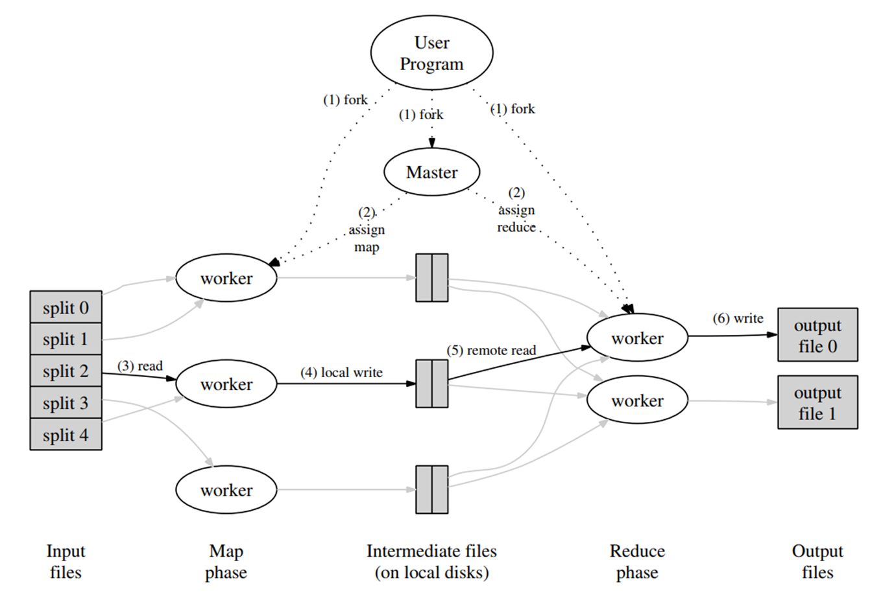

# MapReduce

## Programming Model

## Execution Overview

- map: 把输入数据自动划分为 M 个切片（每个切片的大小大约为 16-64MB）。该过程可以放在不同的机器上并行处理。然后 MapReduce 库会在一个集群的若干台机器上启动程序的多个副本(User Program，其中每个副本都会有一个特殊的主节点 Master)。
- reduce: 通过分区函数(如`hash(key) mod R`)将中间键分配到 R 个切片上

1. fork:
2. assign map: Master 找到空闲的 worker 分配任务(M map tasks & R reduce tasks)
3. read: 分配到 map 任务的 worker 读取对应的 split 里的内容，解析出 kv pairs，并通过自定义的哈希函数来确定不同的 kv pairs 应该存储的位置
4. local write: 将 3 中生成的存储在内存里的 kv pairs 输出到本地磁盘上的 Intermediate files，然后告诉 master 这些文件的位置
5. remote read: 分配到 reduce 任务的 worker 读取 Intermediate files 里的 kv pairs，然后将数据聚合在一起（如果数据量大的话，这里可以使用外部排序）
6. write: 将 reduce 的结果输出到最终文件中

最后也不一定要将 output files 聚合在一起，他很有可能就是另一个 mapreduce 任务的 input files

## Master Data Structure

master 会存储任务的状态(idle, in-progress, completed)和 nonidle 任务的 worker id

## Fault Tolerance

如果最后的几个任务执行时间过长怎么办?存在这种 case,10 个任务用 5 分钟完成了其中 9 个,但最后一个任务因为当前机器的负载过高花费了 20 分钟执行完毕,这么整个任务的执行周期就是 20 分钟。 如何能应对这一问题呢?
当仅剩下 1%的任务时,可以启动备用任务,即同时在两个节点上执行相同的任务。这样只要其中一个先返回即可结束整个任务,同时释放未完成的任务所占用的资源。
