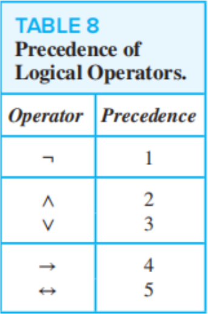
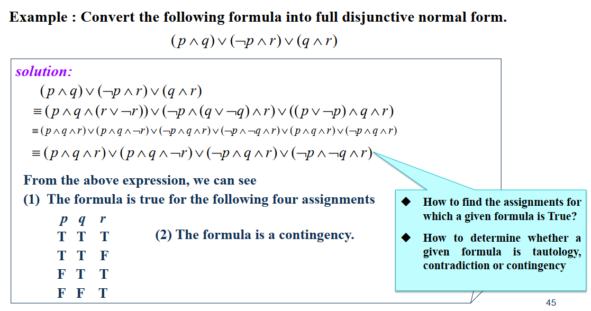
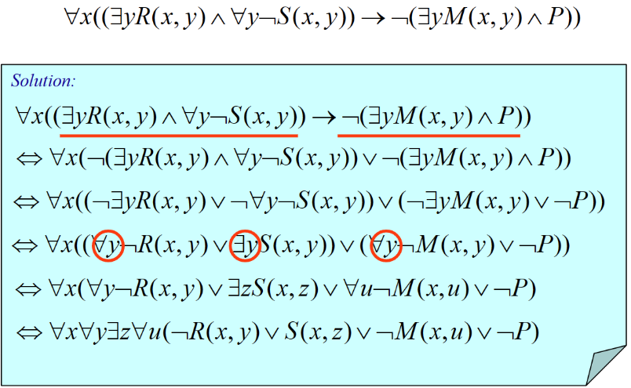

# Chapter 1 The Foundations: Logic and Proofs

## 1 Logic and Proofs

### Propositional Logic

- proposition
- atomic/compound proposition
- propositional variable

!!! question

    If "the statement is false" is a proposition

    ??? success "answer"

        ×. It contradicts.

### Connectives

- **negation**：$\neg p$
- **conjunction**：$p \land q$
- **disjunction, inclusive or**：$p \lor q$
- **exclusive or, XOR**：$p \oplus q$​
- **implication**: $p \rightarrow q$
- **biconditional**: $p \leftrightarrow q$

???+ note "The two meanings of "or""

    We need to judge the meaning of "or" in different contexts
    
    - **inclusive or** : $\lor$​
    - **exclusive or** : $\oplus$

- **converse**：$q \rightarrow p$
- **contrapositive**：$\neg q \rightarrow \neg p$​
- **inverse**：$\neg p \rightarrow \neg q$

!!! note "contrapositive is equivalent to original proposition"

### Truth Table

!!! question "counting problem"

    1. How many rows are there in the truth table with $n$ propositional variable?
    2. How many distinct propositions with $n$ propositional variable?
   
    ??? success "answer"

        1. $2^n$
        2. $2^{2^n}$

### Precedence

## 1.2 Applications of Propositional Logic & 1.3 Propositional Equivalences

- system specification
- consistent

---

- tautology: always true
- contradiction: always false
- contingency: neither a tautology nor a contradiction

### Logic Equivalences

!!! extra

- satisfiable: tautology or contingency
- unsatisfiable

### Propositional Normal Forms

- literal: a variable or its negation
- conjunctive/disjunctive clauses: conjunctions/disjunctions with literals as conjuncts/disjuncts (that is proposition just connected by $\land$ or $\lor$ with literals)

- DNF(disjunctive normal form): disjunction, whose terms(disjuncts) are conjunctions of literals
- CNF is same as DNF: $(A_{1, 1} \vee ... A_{1, n_1}) \wedge ... \wedge (A_{k, 1} \vee ... A_{k, n_k})$

!!! warning

    $\neg$ must behind atomic proposition rather than compound proposition

!!! tip "How to obtain normal form"

      1. eliminate $\rightarrow$, $\leftrightarrow$
      2. move $\neg$ to (by De Morgan's laws and double negation laws), specifically to say, eliminate $\neg$, $\land$, $\lor$ from the scope of $\neg$ such that any $\neg$ has only an atom as its scope
      3. eliminate $\land$ from the scope of $\lor$ or eliminate $\lor$# from the scope of $\land$(by commutative laws, associative laws and distributive laws)

- full DNF/CNF: a minterm is a conjunctive/disjunctive of literals in which each variable is represented exactly once.

!!! question "counting problem"

    If a formula has n variables, how many minterms are there?

!!! tip "How to obtain full DNF"

    - see the example

    ??? example    
     
        
    
    - obtain from truth table

## 1.4 Predicates and Quantifiers

- (n-ary) predicates
- variable
- quantifier
  - universal quantifier $\forall$: $\forall xP(x) \equiv P(x_1) \wedge P(x_2) \wedge \dots \wedge P(x_n)$
  - existential quantifier $\exists$: $\exists xP(x) \equiv P(x_1) \vee P(x_2) \vee \dots \vee P(x_n)$
  - uniqueness quantifier $\exists!$: $\exists !P(x) \equiv \exists x (P(x) \wedge \forall y (P(y) \rightarrow y = x))$​

> We use **predicates** to describe both **preconditions** and **postconditions**

!!! note "quantifiers have higher precedence than all logical operators"

    $\forall x P(x) \lor Q(x) \equiv (\forall x P(x)) \lor Q(x) \ne \forall x (P(x) \lor Q(x))$

!!! note "other logical equivalence"

    - $\forall x (A(x) \wedge B(x)) \equiv \forall xA(x) \wedge \forall xB(x)$
    - $\exists x (A(x) \vee B(x)) \equiv \exists xA(x) \vee \exists xB(x)$
    - $\forall x (A(x) \vee B(x)) \ne \forall xA(x) \vee \forall xB(x)$
    - $\exists x (A(x) \wedge B(x)) \ne \exists xA(x) \wedge \exists xB(x)$

!!! question

    If the domain is empty, then below statement is true or false
    
    - $\forall x P(x)$ 
    - $\exists x P(x)$

    ??? success "answer"

        - *true*: no element x in the domain for which P(x) is false
        - **false**: no element x in the domain for which P(x) is true

1. a single *counterexample* is all we need to establish that "for all x P(x)" is false
2. specify the **domain** is mandatory when **quantifiers** are used
   $\forall x (P(x)\wedge Q(x)) \equiv \forall x P(x) \wedge \forall x Q(x) $
$\exists x (P(x)\vee Q(x)) \equiv \exists x P(x) \vee \exists x Q(x) $

## 1.5 Nested Quantifiers

!!! note "The order of the quantifiers cannot be changed unless all of them are of the same kind"

### Prenex Normal Form(PNF)

!!! tip "How to obtain PNF"

      1. eliminate $\rightarrow$, $\leftrightarrow$
      2. move $\neg$ (like obtaining DNF)
      3. standardize the variables apart (when necessary).
      4. move all quantifiers to the front of the formula.

??? example

    

## 1.6 Rules of Inference

!!! extra