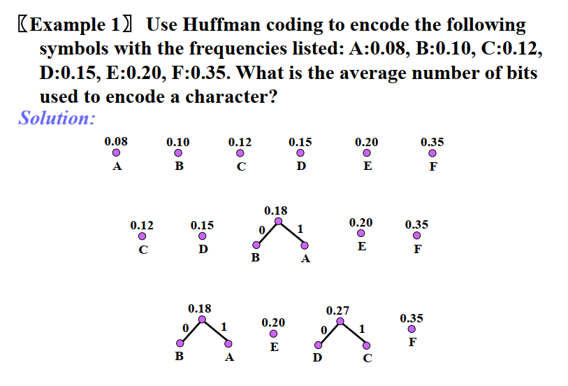
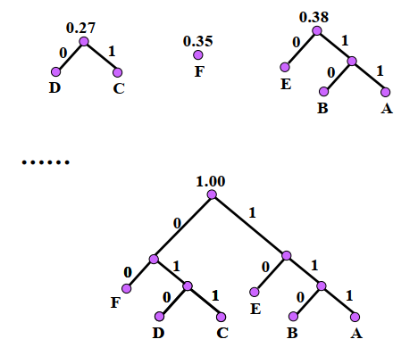
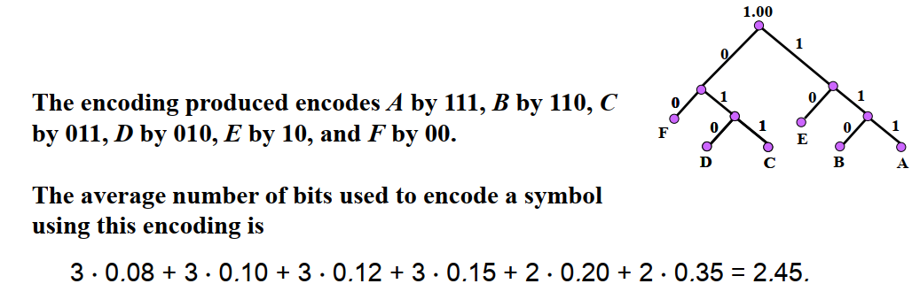

# Chapter 11 Tree

## 11.1 Introduction to Trees

### Basic Terminology & Properties

- tree
- forest
- unrooted/rooted tree
- parent, child, sibling
- ancestor, descenstor
- leaf, internal vertex
- subtree
- m-ary tree -> binary tree(m=2)
- full m-ary tree: every internal vertices have m children
- ordered rooted tree -> left/right child/subtree -> isomorphic

---

- level: the length of path from root to the vertex(the level of root = 0)
- height: maximum level of vertices
- balanced: all leaves are at levels h or h-1
- complete: full and every leaf at the same level

---

- $e=n-1$
- Every tree is a bipartite

!!! question "Counting Problem"

    How many nonisomorphic unrooted/rooted tree are there with n vertices if n = 5?

    !!! tip "可以当作高中算碳链个数的题目做，找root就相当于找不同"

### Full m-ary Tree

A full m-ary tree($n$ vertices, $i$ internal, $l$ leaves)
based on $n=mi+1$ & $n = i + l$

- $n$ => $i = \frac{n-1}{m}$ & $l = \frac{(m-1)n+1}{m}$
- $i$ => $n=mi+1$ & $n = (m-1)i + 1$
- $l$ => $n = \frac{ml-1}{m-1}$ & $i = \frac{l-1}/{m-1}$

### Binary Search Tree

!!! extra "see my fds notes"

### Balanced m-ary Tree

- There are at most $m^h$ leaves in an m-ary tree of height h.
- If an m-ary tree of height h has l leaves, then $h \ge\lceil \log_ml \rceil$
- If the m-ary tree is full and balanced, then $h = \lceil \log_ml \rceil$

## 11.2 Applications of Trees

### Haffman Coding

??? example

    
    
    

## 11.3 Tree Traversal

!!! extra "see my fds notes"

## 11.4 Spanning Trees

!!! extra "see my fds notes"

## 11.5 Minimum Spanning Trees

!!! extra "see my fds notes"
