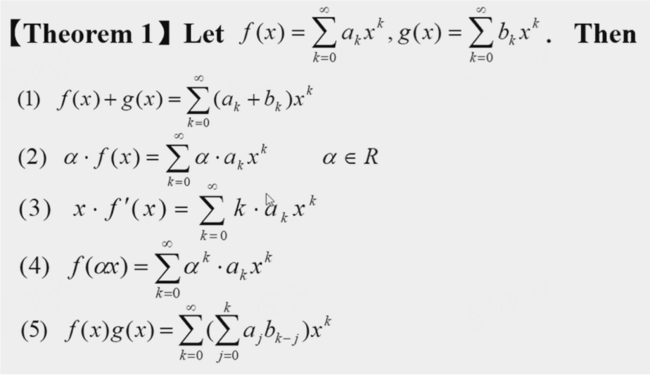
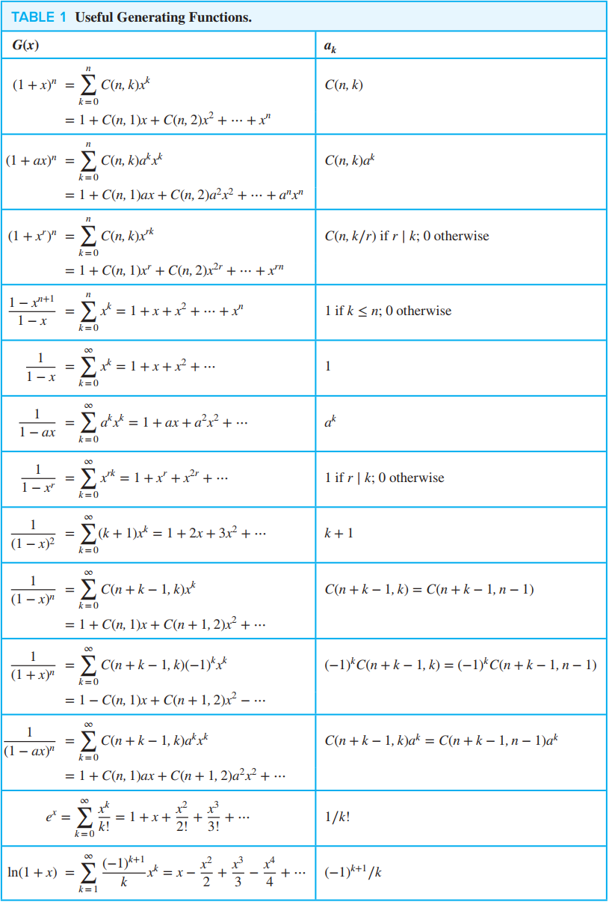

# Chapter 8 Advanced Counting Techniques

## 8.1 Applications of Recurrence Relations

!!! question "common questions in the test paper"

    - Q: Find a recurrence relation and give initial conditions for a specific problem, and then solve $a_k$，$k$ is generally small
    - A: Computing item by item: $a_1 \rightarrow a_2 \rightarrow a_3 \rightarrow \cdots \rightarrow a_k$

!!! question "Find a recurrence relation for the number of bits strings of length n that"

    problem lists

    - contain a pair of consecutive 0s
    - contain three consecutive 0s
    - not contain three consecutive 0s
    - contain the string 01
    - **contain exactly two string 01**

    ??? success "answer"

        === "contain a pair of consecutive 0s"

            $a_n = a_{n-1} + a_{n-2} + 2^{n-2} \ (n \ge 2)$

            - 1+ xxx(bits strings of length n-1 that contain a pair of consecutive 0s)
            - 01+ xxx(bits strings of length n-2 that contain a pair of consecutive 0s)
            - 00 + xxx(any bits strings of length n-2)

        === "contain three consecutive 0s"

            $a_n = a_{n-1} + a_{n-2} + a_{n-3} + 2^{n-3} \ (n \ge 3)$

            - 1+ xxx(bits strings of length n-1 that contain a pair of consecutive 0s)
            - 01+ xxx(bits strings of length n-2 that contain a pair of consecutive 0s)
            - 001+ xxx(bits strings of length n-3 that contain a pair of consecutive 0s)
            - 000 + xxx(any bits strings of length n-3)

        === "not contain three consecutive 0s"

            $a_n = a_{n-1} + a_{n-2} + a_{n-3} \ (n \ge 3)$

            - 1 + xxx(n-1)
            - 01 + xxx(n-2)
            - 001 + xxx(n-3)
            - 000 not meet the contain

        === "contain the string 01"

            $a_n = a_{n-1} + 2^{n-1} - 1 \ (n \ge 2)$
            - 1 + xxx(n-1)
            - 0 +  xxx(any bits strings of length n-1 containing 1)
        
        === "contain exactly two string 01"
            
            !!! extra it's a difficult problem solving with other knowledge(插板法)

### Dynamic Programming

!!! extra "schedule lectures"

## 8.2 Solving Linear Recurrence Relations & 8.3 Divide-and-Conquer Algorithms and Recurrence Relations

some basic conceptions

- linear
- homogeneous/nonhomogeneous
- with constant coefficients
- recurrence relation
- degree
- characteristic equation/root with multiplicity $m$
- general form of solution

???+ example "Fibonacci Sequence"

    $$f_n = \frac{1}{\sqrt{5}} (\frac{1 + \sqrt{5}}{2})^n - \frac{1}{\sqrt{5}} (\frac{1 - \sqrt{5}}{2})^n$$

> I've already studied ODE(ordinary differential equations), so I won't take extra notes in this section

## 8.4 Generating Functions

> Generating functions are useful for manipulating sequences.

- to solve many kinds of counting problems(ex: the problem of combination or permutation with constraints)
- to solve the recurrence relations
- to prove combinatorial identities

> sequence -> series

!!! note "Solutions to find the coefficient"

    1. use brute force algebra and just multiply everything out
    2. view the problem as asking for the solution to a particular combinatorial problem and solve the problem by other means.
    3. get a closed form expression for the coefficients, using the generating function theory developed in this section.

!!! example

    What is the generating function for $\{a_k\}$, where $a_k$ is the number of solutions of $x_1$+ $x_2$+ $x_3$= k when $x_1$,  $x_2$,  and $x_3$ are integers with $x_1\ge2$,  $0\le x_2\le3$,  and $2\le x_3\le5$?

    generating function is $(x^2 + x^ 3+ x^4 + \ldots) ( 1 + x+ x^2 + x^3) (x^2+ x^ 3+ x^4 + x^5) = x^4( 1 + x + x^2)$
    
    Find the coefficient of $x^{10}$ in the power series of each of these functions.
    
    1. $(1+x^{5}+x^{10}+x^{15}+\cdots)^{3}$
    2. $(x^{3}+x^{4}+x^{5}+x^{6}+x^{7}+\cdots)^{3}$

### Extended Binomial Coefficient

**extended binomial coefficient**$\begin{pmatrix}u \\k \end{pmatrix}$:

$$
\begin{pmatrix}u \\k \end{pmatrix} = \begin{cases} \frac{u(u-1) \ldots(u-k+1)}{k!} & \mathrm{if~} k>0 \\1 & \mathrm{if~} k=0 \end{cases}
$$

If $u$ is negative integer, then extended binomial coefficient can also be represented as below:
$\begin{pmatrix}-n \\r \end{pmatrix} = (-1) ^ r\left(\begin{array}{c}n+r-1\\r\end{array}\right)=(-1)^rC(n+r-1,r)$

**The extended binomial theorem**：Let $x$ be a real number with $|x| < 1$, and let $u$ be a real number. Then $(1+x)^u=\sum_{k=0}^\infty\binom ukx^k$

## 8.5 Inclusion-Exclusion 容斥原理

$$
\mid A_1\cup A_2\cup \cdots \cup A_n\mid=\sum_{i=0}^n\mid A_i\mid - \sum_{1\leq i<j\leq n}\mid A_i\cap A_j\mid + \sum_{1\leq i<j<k\leq n}\mid A_i\cap A_j\cap A_k\mid + \cdots + (-1)^{n+1} \mid A_1\cap A_2\cap \cdots \cap A_n \mid
$$

??? question "How to prove it?"

    ??? tip
        
        Suppose a is a member of exactly $r$ of the sets $A_1, A_2, \ldots, A_n$, it is counted $C(r, m)$ times by the summation involving $m$ of the sets $A_i$

!!! example

    1. How many positive integers not exceeding 1000 that are not divisible by 5, 6 or 8?
    2. How many permutations of the 26 letters of the English alphabet do not contain any of the strings fish, rat or bird?
    3.

    !!! warning "计算能被6和8整除的并集时是1000/24（最小公因数）而不是1000/48"

## 8.6 Applications of Inclusion-Exclusion

!!! tip

    - 核心思路就是**正难则反**，然后用总数减去具有某些性质的计数结果
    - 比如错排问题中，正看某个物体的位置是不确定的，但如果反过来看他的位置就是确定的，并且也对其他物体的位置没有要求

### An Alternative Form of Inclusion-Exclusion

- How many solutions does $x_1 + x_2 + x_3 = 11$ have,  where $x_1$, $x_2$ and $x_3$ are nonnegative integers with $x_i > n$ ?

### The Sieve of Eratosthenes 埃氏筛法

- 计数100以内的所有质数
- **反**: - 令 $P_i$ 分别为 100 以内被 2, 3, 5, 7 整除的整数

### The number of Onto Functions

$$n^m - C(n, 1)(n-1)^m - C(n, 2)(n-2)^m - \cdots + (-1)^{n-1}C(n, n-1) \cdot 1^m$$
员工分工作，老师分糖
$A=\{a_1,a_2,\ldots,a_m\},B=\{b_1,b_2,\ldots,b_n\}$
**反**：令 $P_i$ 为 $b_i$ 不在 $A\to B$ 的 range里

!!! question

    - In how many ways can seven different jobs be assigned to four different employees so that each employee is assigned at least one job and the most difficult job is assigned to the best employee?
    
    ??? success "answer"

        - Solution 1: Temporarily ignore the additional condition -> the probability that the most difficult job is assigned to the best employee is $\frac{1}{4}$
        - Solution 2: assign six jobs to four employee +  assign six jobs to three employee
        - Solution 3

            !!! extra "in my draft"

### Derangement 完全错排 -> The Hatcheck Problem

$$
D_n = n![1 - \frac{1}{1!} + \frac{1}{2!} - \frac{1}{3!} + \cdots + (-1)^n \frac{1}{n!}]
$$

$$
\frac{D_n}{n!} \approx e^{-1} \approx 0.368
$$
