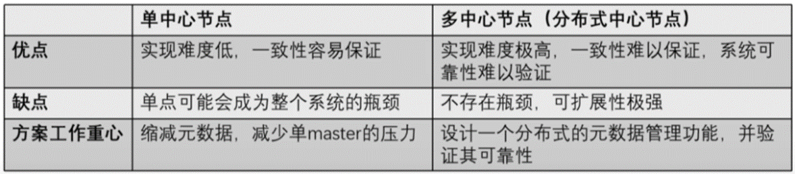
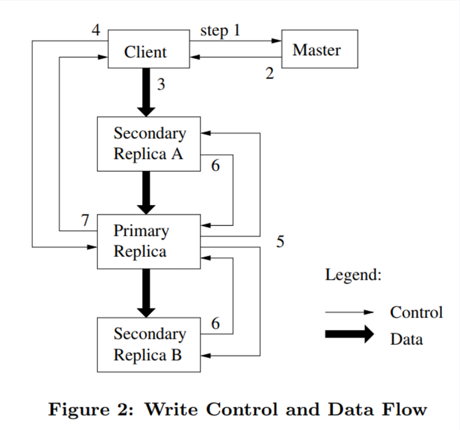

# GFS

最主要的特性：弱一致性(weak consistency)，单主(single-master)

## Introduction

## Architecture

- 一个 GFS 集群包含了 **a single master**, **multiple chunkservers**，并且可以被多个**clients**访问
- 每个文件都会被分成多个 chunk(64MB in GFS)，每个 chunk 都会有一个唯一的 64bits 的 chunk handle 来标识，并且一般会有三个副本存储到不同的 chunkserver 上。我们可以通过 chunk handle 和 byte range(字节范围)来确定要读写的块
- single master 存储 [[#^193eb2|metadata]]，并且控制系统级活动，如 chunk 的租约管理，垃圾回收，和 chunk 在不同 chunkserver 之前的迁移，master 通过心跳机制来与每个 chunkserver 通信
- client 可以跟 master 和所有的 chunkservers 之间的通信。然后 client 上会缓存元数据，而不会缓存文件数据，一方面是文件数据很大，无法缓存，另一方面就是如果要缓存数据还要保证缓存一致性问题，这样系统就会更加复杂了，而缓存文件数据本来就是个没什么用的操作

## Single Master

GFS 采用了一系列措施来确保 master 不会成为整个系统的瓶颈：

1. 所有的数据流都不经过 master，而是直接由 client 和 chunkserver 交互（GFS 把控制流和数据流分离，只有控制流才会经过 master）
2. client 会缓存 master 中的元数据，在大部分情况下，都无需访问 master。
3. 采用了一些手段来节省 master 的内存，包括增大 chunk 的大小以节省 chunk 的数量、对元数据进行定制化的压缩等。
   master 可以根据 client 提供的文件名和存储的偏移量知道副本所存在的位置

## Chunk Size

64MB(much larger than typical file system block sizes)

- advantage:
  1. reduces clients’ need to interact with the master.
  2. perform many operations on a given chunk, it can reduce network overhead by keeping a persistent TCP connection to the chunkserver over an extended period of time.
  3. reduces the size of the metadata stored on the master.
- disadvantage:
  1.
  2. hot spot
  3. internal fragmentation

lazy space allocation:

## Metadata 元数据

The master stores three major types of metadata(keep in memory):

- the file and chunk namespaces (**persistence**)
- the mapping from files to chunks (**persistence**)
- the locations of each chunk’s replicas (**nonpersistence**)

The first two types (namespaces and file-to-chunk mapping) are also kept persistent by logging mutations to an operation log stored on the master’s local disk and replicated on remote machines. Using a log allows us to update the master state simply, reliably, and without risking inconsistencies in the event of a master crash.

为什么 chunk 副本的位置不持久化？
可以通过持久化来恢复 master 宕机时间，但是这个数据信息 master 可以通过访问所有 chunkservers 来获取，考虑到 master 挂掉的情况不多，所以我们不存储来缩减 metadata，从而减少 master 的压力

master 会周期性地扫描 metadata，实现垃圾回收，chunkserver 故障时重做副本，负载均衡等功能

其他高可用设计：[[#^7424f7|Operation Log]]操作日志相关

## Consistency Model

每个 chunk 文件在被修改时其 chunk version 都会自增，写操作会识别出那些 chunk version 落后的 chunk 并跳过写，这些落后的 chunk 会在垃圾回收过程被回收。每个 64Mb 的 chunk 文件的每个 64Kb 数据 block，都会记录一个 checksum（持久化到专门的 logging 文件），读取数据时需校验 checksum 是否正确来判断数据是否损坏。

master 对于分布式文件的新增、删除是强一致性的。GFS 在 master 有一个文件锁的设计，对文件加写锁可以防止并发创建同名的分布式文件，对目录加写锁可以防止目录下的文件新增和删除。

1. 对一个 chunk 所有副本的写入顺序都是一致的。这是由控制流和数据流分离技术实现的，控制流都是由 primary 发出，而副本的写入顺序也是由 primary 到 secondary。
2. 使用 chunk 版本号来检测 chunk 副本是否出现过宕机。失效的副本不会再进行写入操作 master 不会再记录这个副本的信息(等 Client 刷缓存时同步)，GC 程序会自动回收这些副本
3. master 会定期检查 chunk 副本的 checksum 来确认其是否正确。
4. GFS 推荐应用更多地使用追加来达到更高的一致性。

gfs关于写的两个接口

- write 操作可以将任意⻓度 len 的数据写入到任意指定文件的位置 off set
- record append 操作可以**原子**的将 len<=16MB 的数据写入到指定文件的末尾

## GFS 的高可用设计

高可用问题（容错问题）：在发生故障时仍能不丢失数据并保持对外服务 -> 共识算法

GFS 诞生时共识算法不成熟，所以 Google 为此额外设计了高可用方案
解决问题

1. 保证服务器在故障时文件不损坏不丢失
   master 的 WAL 和主备；chunk 的多副本
1. 在超多机器的情况下，实现**自动**监控、容错与恢复（自动切换主备）
   master 的主备切换有 chubby 负责；chunk 的租约；master 负责副本的位置和数量
   > 当时自动运维是一个比较特殊的设定

### master 高可用设计（针对 metadata）

^7424f7

- 存在 primary master 和 shadow master（作为备份）
- 使用操作日志来持久化元数据
- 生成新增元数据的日志并写入本地磁盘
- 把 WAL(write head log)传输给 shadow master
- 得到反馈后再正式修改 primary master 的内存。
- master 可以通过重放操作日志来恢复文件系统的状态

自动切换：如果 master 宕机，会通过 Google 的 Chubby 来识别并切换到 shadow master(秒级操作) *和 MySQL 的主备机制非常像*

### chunk 的高可用设计

- 在 GFS 中，对一个 chunk 的每次写入，必须确保**在三个副本中的写入都完成**，才视为写入完成
- 一个 chunk 的所有副本都会具有完整的数据。
- 如果一个 chunkserver 宕机，它上面的所有 chunk 都有另外两个副本依旧可以保存这个 chunk 的数据。
- 如果这个宕机的副本在一段时间之后还没有恢复，那么 master 就可以在另一个 chunkserver 重建一个副本，从而始终把 chunk 的副本数目维持在 3 个(可以设置)。

- GFS 维持每个 chunk 的校验和，读取时可以通过校验和进行数据的校验。如果校验和不匹配 chunkserver 会反馈给 master 处理，master 会选择其他副本进行读取，并重建此 chunk 副本，为了减少对 master 的压力，GFS 采用了一种**租约**(Lease)机制，把_文件的读写权限下放给某一个 chunk 副本。_
- Master 可以把租约授权给某个 chunk 副本，我们把这个 chunk 副本称为**primary**，在租约生效的一段时间内，对这个 chunk 的写操作直接由这个副本负责，租约的有效期一般为 60 秒
- 租约的主备只决定控制流走向，不影响数据流。

!!! attention
标准的主备同步：数据流和控制流都是从主到备
GFS 的租约机制：primary 只决定控制流走向，即决定写操作的顺序，但是数据流并不一定要通过 primary，而是采取了就近原则

- Chunk 副本的放置也是一个关键问题，GFS 中有三种情况需要 master 发起创建 chunk 副本分别是新 chunk 创建、chunk 副本复制(re-replication)和负载均衡(rebalancing)
- **副本复制**则是指因为某些原因，比如一个副本所在的 chunkserver 宕机，导致 chunk 副本数小于预期值(一般为 3)后，新增一个 chunk 副本;
- **负载均衡**则发生在 master 定期对 chunkserver 的监测，如果发现某个 chunkserver 的负载过高就会执行负载均衡操作，把 chunk 副本搬到另外的 chunkserver 上。当然，这里的“搬迁"操作，实际上就是新建 chunk 和删除原 chunk 的操作。
- 这三个操作中，master 对副本位置的选择策略是相同的，要遵循以下三点：
  1. 新副本所在的 chunkserver 的资源利用率较低
  2. 新副本所在的 chunkserver 最近创建的 chunk 副本不多。这里是为了防止某个 chunkserver 瞬间增加大量副本，成为热点
  3. chunk 的其他副本不能在同一机架（为了保证机架或机房级别的高可用）

## GFS 的读写流程

GFS 作为一个文件系统，对读写的需求是什么样的呢？

- 读取 → 快速，为了极致的性能，可以读到落后的版本，但一定不能是错误的
- 写入一进一步分为两种:改写(overwrite)和追加(append)
- 改写 → 正确，通常不用在意性能。在意性能的改写可以转为追加。
- 追加 → 快速，为了极致的性能，可以允许一定的异常，但追加的数据一定不能丢失。

## 写入

- 写入时要在三个副本都完成写入后才能返回写入结果（为了保证读的高效准确）

GFS 的写入采用了两个在现在看来都非常高端的技术

- 流水线技术：client 会把文件数据发往离自己最近的一个副本，无论它是否是主(是否持有租约)。这个副本在接收到数据后，就立刻向其他副本转发(一边接收一边转发)。这样就控制了数据的流向，节省了网络传输代价。
- 数据流与控制流分离技术：GFS 对一致性的保证可以不受数据同步的干扰

写入流程

1. Client 向 Master 询问要写入 chunk 的租约在哪个 chunkserver 上(Primary Replica)，以及其他副本(Secondary Replicas)的位置(通常 Client 中直接就有缓存)。如果目前没有任何一个 chunkserver 持有要访问的 chunk 的租约，master 就会选择一个副本，授予一个租约
2. Master 返回数据，Client 接收并缓存数据。只有当 primary 无法访问或者不再持有租约时客户端才会再次和 master 交互
3. Client 将数据发送到所有的副本上（不管发送的顺序），chunkserver 会把数据存储到内部的 LRU buffer 缓存中，直到这些数据被调用或是老化。通过将数据流与控制流解耦，我们可以通过基于网络拓扑调度昂贵的数据流来提高性能，而不管哪个 chunkserver 是 primary 的。（这一步就会用到流水线技术，也是写入过程中唯一的数据流操作）
4. 确认所有副本都收到了数据之后，Client 就会向 Primary 发送 write 请求。primary 给其收到的所有修改指定连续的序列号，由于这些修改可能来自多个客户端，所有进行编号是有必要的。primary 按着序号的顺序将修改应用到自己的本地状态。（这里 Primary Replica 唯一确定写入顺序，保证副本**一致性**）
5. primary 把 write 请求传递给所有的 secondary 副本，每个 secondary 副本以由 primary 指定的同样的序列号顺序应用修改（执行到这里 primary replica 已经写入成功了）
6. 所有的 Secondary 回复 Primary 告知写入完成。
7. Primary 回复 Client，会报告任何副本遇到的任何错误。如果有错误，write 可能已经在 primary 和部分 secondary 中成功完成了（如果操作是在 primary 这里失败了，那么其就不会被指定序列号并向 secondary 传递命令）此时 client 会认为请求已经失败，已经修改完的区域就会处于  *inconsistent*  的状态。然后 client 会重新从第 3 步开始执行

如果应用程序的 write 很大或者跨过了一个 chunk 的边界，client 就会把其拆成多个 write 操作。这些新的 write 操作也都遵循上述控制流（图 2），但可能会与来自其他客户端的并发操作交错并被覆盖。因此，共享文件区域最终可能包含来自不同客户端的片段，尽管副本将是相同的，因为单个操作在所有的副本上以相同的顺序成功完成。这就会出现我们在 2.7 中提到过的  *consistent*  但  *undefined*  的状态
undefined 就是指比如写入 A B 期望的是 A1, A2, B，但最终可能是 A1, B, A2

GFS 对于 chunk 的一致性有两种定义：

- consistent：客户端永远能看到一致的数据，无论他们从哪个 replica 读取数据；
- defined：当某个 chunk 发生修改后，client 能看到刚刚修改的所有数据。

write = update or append

- update 如果部分 chunk 成功，部分失败，那我们读到的文件就是不正确的
- update 大概率是一个分布式操作，也可能只是不断重复请求保证弱一致性（最终一致性）
- 追加失败的话，我们只是会读到过期而非错误的数据

!!! caution "GFS 的一致性"
GFS(以及 Google 的绝大多数应用都)推荐使用 append

# GFS 的一致性

1. 对一个 chunk 所有副本的写入顺序都是一致的。这是由控制流和数据流分离技术实现的，控制流都是由 primary 发出，而副本的写入顺序也是由 primary 到 secondary。
2. 使用 chunk 版本号来检测 chunk 副本是否出现过宕机。失效的副本不会再进行写入操作 master 不会再记录这个副本的信息(等 Client 刷缓存时同步)，GC 程序会自动回收这些副本
3. master 会定期检查 chunk 副本的 checksum 来确认其是否正确。
4. GFS 推荐应用更多地使用追加来达到更高的一致性。

## Advantage and Disadvantage

Advantage
master 和 chunkserver 的设计，将文件管理和文件存储分离
将文件分割成 chunk 存储，可并发访问，吞吐量较大
修改数据时控制流和数据流分离，充分利用每台机器的带宽
使用 lease 降低 master 工作负载，防止 split-brain 问题
对文件追加和顺序读的功能有优化
好的容错性
Disadvantage
只有一个 master ，元数据过多的话可能内存不够用
client 量很大的话，一个 master 负载过大
master 不能出错自动重启，出故障后人工切换 master 比较耗时
master 通过浏览所有的 chunk 进行垃圾回收效率太低
不擅长处理随机写问题、海量小文件存储
一致性过松，无法处理对一致性要求高的任务
GFS 被设计用于运行在单个数据中心的系统
