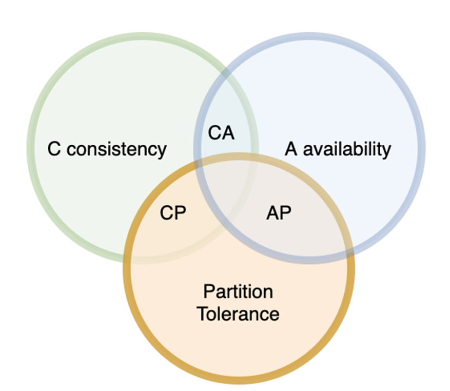
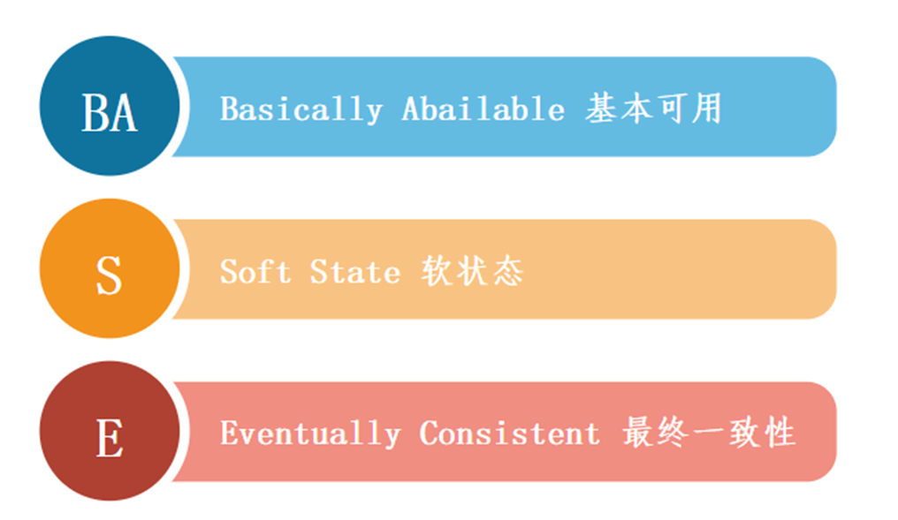

> 高可用问题
> 内部一致性和外部一致性：作为分布式系统主要包括外部一致性即可

**分布式系统的优点**

1. 分布式系统中的所有节点都是相互连接的。所以**节点可以很容易地与其他节点共享数据**。
2. 更多的节点可以很容易地添加到分布式系统中，即可以**根据需要进行扩展**。
3. **一个节点的故障不会导致整个分布式系统的失败**。其他节点仍然可以相互通信。
4. **硬件资源可以与多个节点共享**，而不是只限于一个节点。

**分布式系统的缺点**

1. 在分布式系统中**很难提供足够的安全**，因为节点以及连接都需要安全。
2. **一些消息和数据在从一个节点转移到另一个节点时，可能会在网络中丢失**。
3. 与单用户系统相比，**连接到分布式系统的数据库是相当复杂和难以处理的**。
4. 如果**分布式系统的所有节点都试图同时发送数据，网络中可能会出现过载现象**。

## CAP Theorem

- **一致性** ：数据在多个副本之间能够保持一致的特性。
- **可用性**：系统提供的服务一直处于可用的状态，每次请求都能获得正确的响应。
- **分区容错性**：分布式系统在遇到任何网络分区故障的时候，仍然能够对外提供满足一致性和可用性的服务。

### 为什么 CAP 不可兼得？

分布式系统，是避免不了分区的，分区容错性是一定要满足的，我们看看在满足分区容错的基础上，能不能同时满足 consistency 和 availability？

那么满足分区容错的基础上，能不能同时满足`一致性`和`可用性`？

### CAP 原则权衡

> CAP 三者不可同得，那么必须得做一些权衡。

- **CA without P**❌
  如果不要求 P（不允许分区），则 C（强一致性）和 A（可用性）是可以保证的。但是对于分布式系统，分区是客观存在的，其实分布式系统理论上是不可选 CA 的。
- **CP without A**
  如果不要求 A（可用），相当于每个请求都需要在 Server 之间强一致，而 P（分区）会导致同步时间无限延长，如此 CP 也是可以保证的。很多传统的数据库分布式事务都属于这种模式：分布式数据库，分布式锁
- **AP without C**
  要高可用并允许分区，则需放弃一致性。一旦分区发生，节点之间可能会失去联系，为了高可用，每个节点只能用本地数据提供服务，而这样会导致全局数据的不一致性。现在众多的 NoSQL 都属于此类：Web 缓存，DNS

### CAP 原则实际应用

我们应该都接触过微服务，常见的可以作为注册中心的组件有：ZooKeeper、Eureka、Nacos...。

1. **ZooKeeper 保证的是 CP。**  任何时刻对 ZooKeeper 的读请求都能得到一致性的结果，但是， ZooKeeper 不保证每次请求的可用性比如在 Leader 选举过程中或者半数以上的机器不可用的时候服务就是不可用的。
2. **Eureka 保证的则是 AP。** Eureka 在设计的时候就是优先保证 A （可用性）。在 Eureka 中不存在什么 Leader 节点，每个节点都是一样的、平等的。因此 Eureka 不会像 ZooKeeper 那样出现选举过程中或者半数以上的机器不可用的时候服务就是不可用的情况。 Eureka 保证即使大部分节点挂掉也不会影响正常提供服务，只要有一个节点是可用的就行了。只不过这个节点上的数据可能并不是最新的。
3. **Nacos 不仅支持 CP 也支持 AP。**

放弃 A（可用），相当于每个请求都需要在 Server 之间强一致，而 P（分区）会导致同步时间无限延长，如此 CP 也是可以保证的。很多传统的数据库分布式事务都属于这种模式。

## BASE Theorem

BASE 理论是对 CAP 中一致性 C 和可用性 A 权衡的结果，其来源于对大规模互联网系统分布式实践的总结，是基于 CAP 定理逐步演化而来的，它大大降低了我们对系统的要求。

> BASE 理论的核心思想是：即使无法做到强一致性（Strong consistency），但每个应用都可以根据自身的业务特点，采用适当的方式来使系统达到最终一致性（Eventual consistency）。

### BASE 理论的三个特性

1. **基本可用**：假如系统出现了不可预知故障，允许损失部分可用性，当然也不能完全不可用。

> 损失的这部分可用性指：
>
> - **响应时间上的损失**：正常情况下的搜索引擎 0.5 秒即返回给用户结果，而基本可用的搜索引擎可以在 2 秒作用返回结果。
> - **功能上的损失**：在一个电商网站上，正常情况下，用户可以顺利完成每一笔订单。但是到了大促期间，为了保护购物系统的稳定性，部分消费者可能会被引导到一个降级页面。

2. **软状态**：允许系统中的数据存在中间状态（**CAP 理论中的数据不一致**），并认为该中间状态的存在不会影响系统的整体可用性，即允许系统在不同节点的数据副本之间进行数据同步的过程存在延时。
3. **最终一致性**：强调的是系统中所有的数据副本，在经过一段时间的同步后，最终能够达到一个一致的状态。因此，最终一致性的本质是需要系统保证最终数据能够达到一致，而不需要实时保证系统数据的强一致性。

## 分布式一致性的 3 种级别：

1. **强一致性** ：系统写入了什么，读出来的就是什么。
2. **弱一致性** ：不一定可以读取到最新写入的值，也不保证多少时间之后读取到的数据是最新的，只是会尽量保证某个时刻达到数据一致的状态。
3. **最终一致性** ：弱一致性的升级版，系统会保证在一定时间内达到数据一致的状态。

> 业界比较推崇是最终一致性级别，但是某些对数据一致要求十分严格的场景比如银行转账还是要保证强一致性。

> 最终一致性怎么保证呢？
>
> - **读时修复** : 在读取数据时，检测数据的不一致，进行修复。比如 Cassandra 的 Read Repair 实现，具体来说，在向 Cassandra 系统查询数据的时候，如果检测到不同节点 的副本数据不一致，系统就自动修复数据。
> - **写时修复** : 在写入数据，检测数据的不一致时，进行修复。比如 Cassandra 的 Hinted Handoff 实现。具体来说，Cassandra 集群的节点之间远程写数据的时候，如果写失败 就将数据缓存下来，然后定时重传，修复数据的不一致性。
> - **异步修复** : 这个是最常用的方式，通过定时对账检测副本数据的一致性，并修复。
