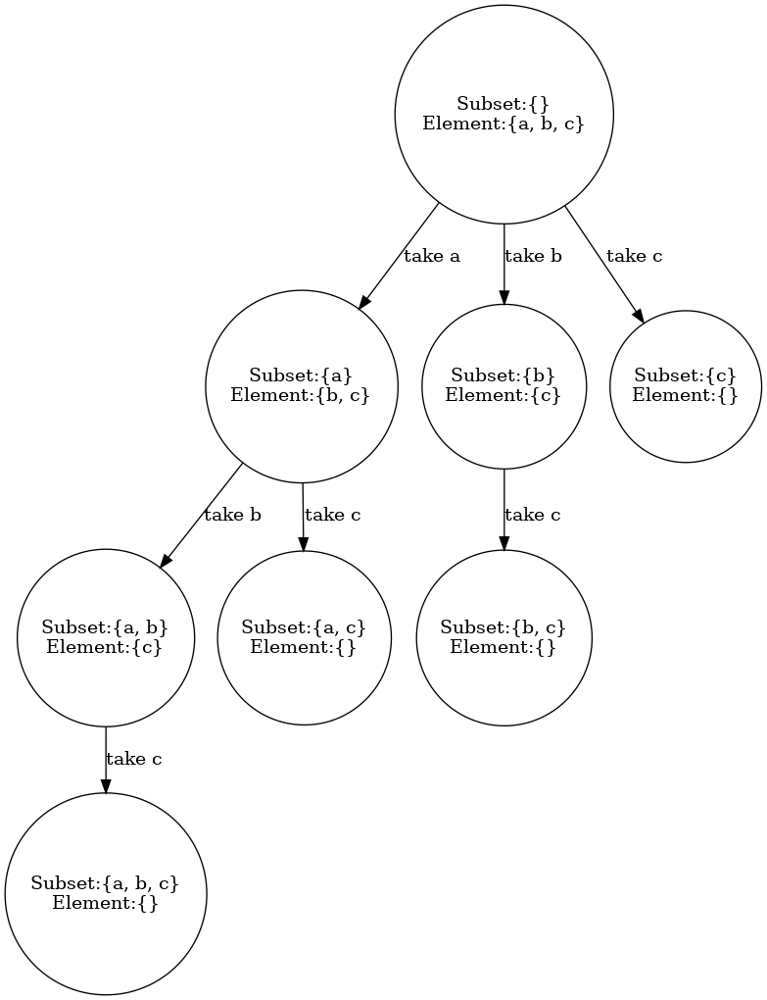
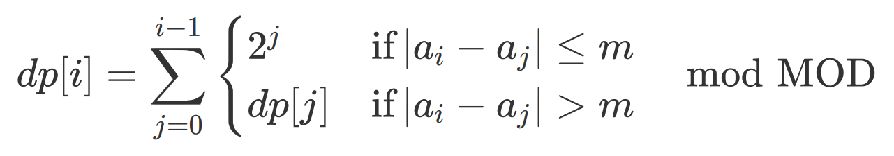
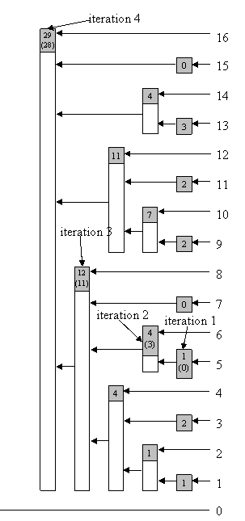
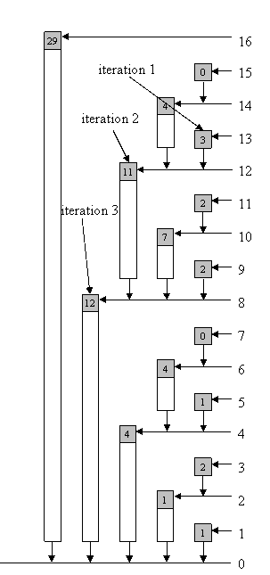
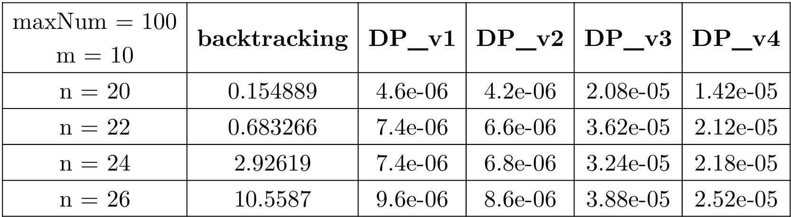
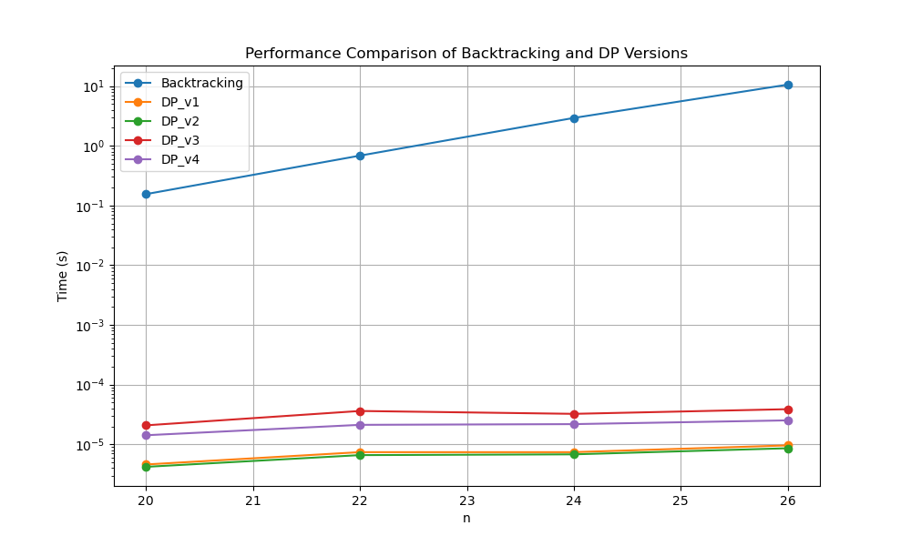
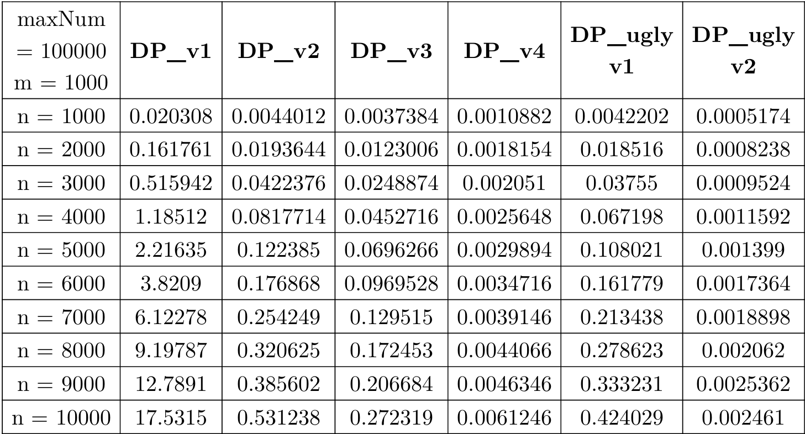
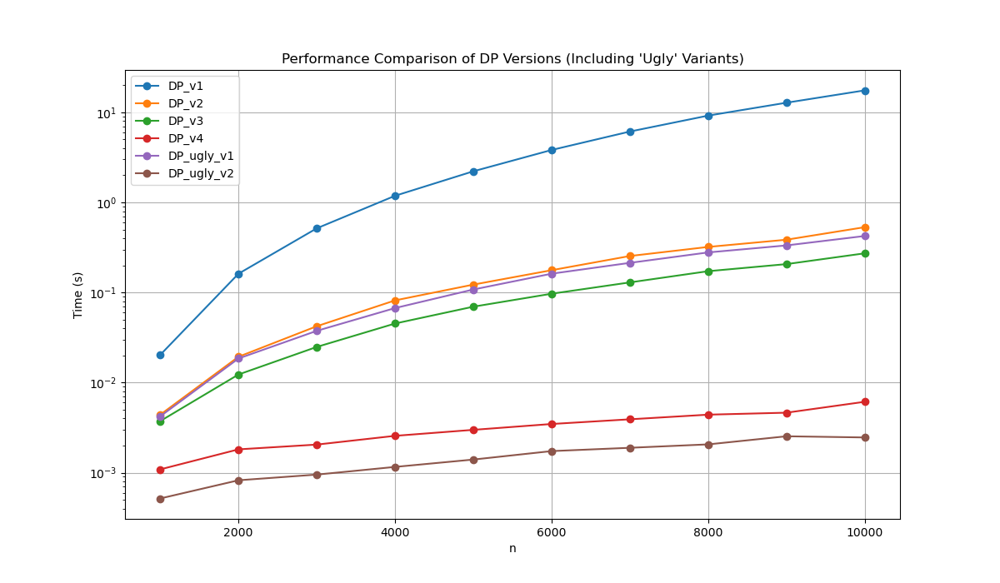

<div class="middle center">
<div style="width: 100%">

# Beautiful Sequence

<hr/>

By 32nd Group

钱满亮，陈锟，彭程，陈无为

<!--v-->

## Table of Contents

### 1. Introduction

### 2. Backtracking

### 3. Dynamic Programming

### 4. Optimizations

<!-- - Binary Inverted Index
- Quick Power
- Reversed Approach -->

### 5. Test Results

<!--s-->

<div class="middle">
<div style="width: 100%">

## Part.1 Introduction

<!--v-->

## Beautiful Subsequence

**Definition:** A beautiful subsequence contains two consecutive elements whose difference is no greater than $m$

<!-- <hr style="border: none; height: 3px; background-color: rgb(186, 181, 175);"> -->

**Project Focus:** In this project, we will concentrate on the problem of finding all the beautiful subsequences in a given array and counting the number of them in various ways.

<!-- <hr style="border: none; height: 3px; background-color: rgb(186, 181, 175);"> -->

<!--s-->

<div class="middle">
<div style="width: 100%">

## Part.2 Backtracking

1. Find all subsequences
2. Check if it is a beautiful sequence

<!--v-->

## Find all subsequences

<!--  -->


<!--v-->

## Find all subsequences

```cpp [6-11|3]
void backtracking(const vector<int> &sequence, int diff, int index)
{
    if (checkSequence(subseq, diff))
        BTcount++;

    for (int i = index; i < sequence.size(); i++)
    {
        subseq.push_back(sequence[i]);
        backtracking(sequence, diff, i + 1);
        subseq.pop_back();
    }
}
```

- Time Complexity: $O(2^N)$

For all subsequences, we need to check if there are two consecutive elements whose difference is no greater than $m$.

<!--v-->

## Check beautiful conditions

```cpp [|4]
bool checkSequence(const vector<int> &seq, int diff)
{
    for (int i = 1; i < seq.size(); i++)
        if (abs(seq[i] - seq[i - 1]) <= diff)
            return true;
    return false;
}
```

- Time Complexity: $O(N)$

<br/>

=> Time Complexity of Backtracking is $O(N \cdot 2^N)\ $ .

- **TOO SLOW!** Its inefficiency will be visually demonstrated in the part of test results.

<!--s-->

<div class="middle">
<div style="width: 100%">

## Part.3 Dynamic Programming

1. State transition equation
2. Optimal substructure
3. No aftereffect
4. Overlapping subproblems

<!--v-->

## State transition equation

<!-- $$
dp[i] = \sum_{j=0}^{i-1} \begin{cases}2^j&\text{if}\left|a_i-a_j\right|\leq m\\dp[j]&\text{if}\left|a_i-a_j\right|> m\end{cases}\mod\text{MOD}
$$ -->



For each element `arr[i]`, check all prior elements `arr[j]` where `j < i`.

- If `|arr[i] - arr[j]| <= m`, then *any subsequence of the first `j-1` elements* can be extended by `arr[j]` and `arr[i]` to form a new beautiful subsequence ending at `arr[i]`.
- Otherwise, if `|arr[i] - arr[j]| > m`, *the beautiful sequence ending at `j`* can be extended by `arr[i]` to form a new beautiful subsequence ending at `arr[i]`. Therefore, `dp[i]` accumulates the counts from `dp[j]` or $2^{j-1}$.

<!--v-->

## Optimal substructure

Solution to `dp[i]` depends on all optimal solutions of smaller subproblems. (all `dp[j]` where `j < i`)

The total number of beautiful subsequences ending at `i` is constructed from subsequences ending at earlier indices (`j<i`) that satisfy the difference condition, plus subsequences that can simply propagate without modification.

<!--v-->

## No aftereffect

The value of `dp[i]` is not affected by the value of `dp[j]` where `j > i`.

- The state `dp[i]` encapsulates all the necessary information about subsequences ending at `i`, and the past states (`dp[k]` for `k<j`) do not directly influence `dp[i]` once `dp[j]` is computed.
- This property ensures that the algorithm can proceed iteratively or recursively without maintaining additional information about how earlier states were reached.

<!--v-->

## Overlapping subproblems

The problem has overlapping subproblems because the subsequences ending at i overlap significantly with subsequences ending at earlier indices `j`.

- For each `dp[j]`, the computation of `dp[i]` reuses these values either directly (`dp[i]+=dp[j]`) or indirectly through $2^j$.
- Without dynamic programming, a naive recursive approach would recompute these values multiple times, leading to exponential complexity. By storing the results in the dp array, the algorithm avoids redundant calculations.

<!--s-->

<div class="middle">
<div style="width: 100%">

## Part.4 Optimization

1. Binary Inverted Index
2. Quick Power
3. Reversed Approach

<!--v-->

## Binary Inverted Tree


The **Binary Indexed Tree (BIT)**, also known as a **Fenwick Tree**, is a powerful data structure used for efficiently managing **prefix sums** and supporting **dynamic updates** and **range queries**.

BIT uses the **binary representation of indices** to organize and manage cumulative sums:

Each index in the tree covers a specific range of the original array based on the **least significant bit (lowbit)**.
A single node in the BIT stores the sum of elements over a certain range of the array.

```cpp
int lowbit(int x) { return x & (-x); }
```

<!--v-->

## Add / Update



Add value to arr[pos] and update the BIT

```cpp []
void add(int pos, vector<int> &arr, int value)
{
    for (int i = pos; i <= MAXN; i = i + lowbit(i))
        arr[i] = (arr[i] + value) % MOD;
}
```

- Time Complexity: $O(\log N)$

<!--v-->

## Query



Compute the sum of the range [1, idx].

```cpp [8-9]
int query(int pos, vector<int> &arr)
{
    if (pos <= 0)
        return 0;
    if (pos > MAXN)
        return query(MAXN, arr);
    int sum = 0;
    for (int i = pos; i > 0; i = i - lowbit(i))
        sum = (sum + arr[i]) % MOD;
    return sum;
}
```

- Time Complexity: $O(\log N)$
<!--v-->

## Quick Power

```cpp [|5]
int nativePow(int base, int exp)
{
    long long result = 1;
    for (int i = 0; i < exp; i++)
        result = (result * base) % MOD;
    return result;
}
```

- Time Complexity: $O(\log N)$

<!--v-->

## Quick Power(cont.)

```cpp [|6-9]
int QuickPow(long long base, long long exp)
{
    long long res = 1;
    while (exp)
    {
        if (exp & 1)
            res = (res * base) % MOD;
        base = (base * base) % MOD;
        exp >>= 1;
    }
    return res;
}
```

- Time Complexity: $O(N)$

<!--v-->

## Reversed Approach

- **Do exactly the opposite**. Compute the number of **ugly** sequence.

- Definition of **ugly**: a sequence that contains no two neighbors with difference larger than m

- State transition equation:

$$
dp[i] = \sum_{j=0}^{i-1} dp[j]\ \ \text{if} |a_i-a_j| > m \mod\text{MOD}
$$

- Time Complexity
  - Without BIT: $O(N^2)$
  - With BIT: $O(N \log N)$

<!--v-->

## Final Code

```cpp []
int DP_ugly_v2(const vector<int> &sequence, int diff)
{
    vector<int> dp(MAXN, 0);
    for (int i = 0; i < sequence.size(); i++)
    {
        int x = sequence[i];
        int left = x - diff, right = x + diff;
        long long tmp = 0;
        tmp += query(left - 1, dp) + query(MAXN, dp) - query(right, dp);
        tmp = (tmp + MOD) % MOD;
        add(x, dp, tmp + 1);
    }

    return (QuickPow(2, sequence.size()) - 1 - query(MAXN, dp) + MOD) % MOD;
}
```

<!--s-->

<div class="middle">
<div style="width: 100%">

## Part.5 Test Results

1. The comparison of cost time between Backtracking and DP.
2. The comparison of cost time between all DP algorithms.

<!--v-->

**Comparison between BT and DP**

Since the time complexity of the backtracking algorithm is relatively high, it reaches the level of seconds when the data size is around 20. Therefore, when testing the efficiency of the backtracking method, we limited the data size to a very small range.


<!--  -->

<!--v-->

**Comparison between BT and DP(cont.)**

- The performance of backtracking algorithm degrades significantly as the input size increases. The time taken by backtracking grows exponentially with the input size, making it
unsuitable for larger inputs.
- The dynamic programming solutions show a clear improvement over backtracking algorithm.



<!--v-->

**Comparison between all DP algorithms**



<!--v-->

**Comparison between all DP algorithms(cont.)**

The cost time of all different versions of DP shown in the line chart is: DP_ugly_v2 $\approx$ DP_v4 < DP_v3 $\approx$ DP_ugly_v2 $\approx$ DP_v2 < DP_v1. The DP_ugly_v2 is themost efficient algorithm among all the algorithms



<!--s-->

<div class="middle">
<div style="width: 100%">

# Thanks for Listening
