

# Distributed System

Consistency Protocol

——钱满亮

<!--v-->

## Table of Contents

### 1. 2PC/3PC

### 2. Paxos

### 3. Raft

### 4. ZAB

### 5. Byzantine Problem

<!--s-->

# Part.1 2PC/3PC

Two/Three-Phase Commit

<!--v-->

## 2PC Phase 1: Prepare

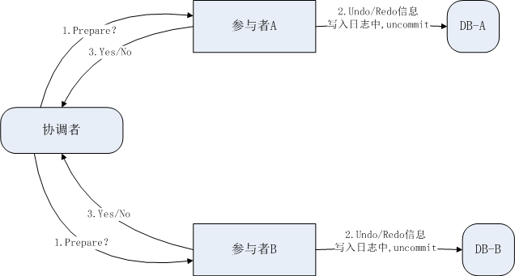

<!--v-->

## 2PC Phase 2: Commit/Rollback

Situation 1: All replies are YES -> Commit

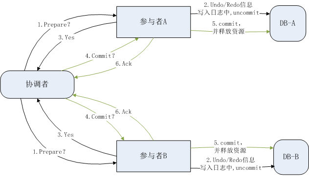

<!--v-->

## 2PC Phase 2: Commit/Rollback

Situation 2: Some replies are NO -> Rollback

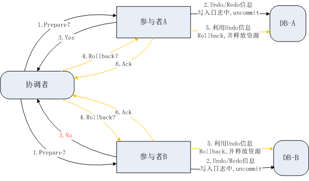

<!--v-->

## 2PC Pros and Cons

### Pros

1. Ensures transaction atomicity in a distributed environment
2. The structure is relatively simple and easy to understand

### Cons

1. Performance overhead
2. Single point of failure
3. Blocking problem

<!--v-->

## 3PC Phase1: CanCommit

like Prepare Phase in 2PC

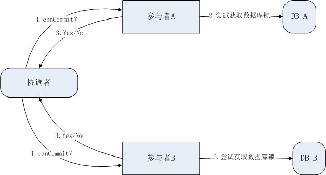

<!--v-->

## 3PC Phase2: PreCommit

Situation 1: All replies are YES -> PreCommit

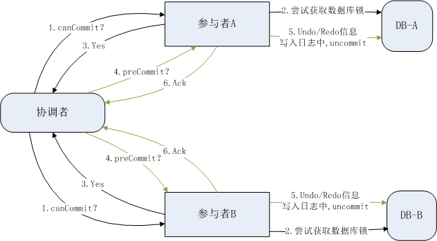

<!--v-->

## 3PC Phase2: PreCommit

Situation 2: Some replies are NO -> Abort

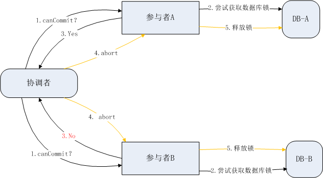

<!--v-->

## 3PC Phase3: DoCommit

Situation 1: All replies are YES -> Commit

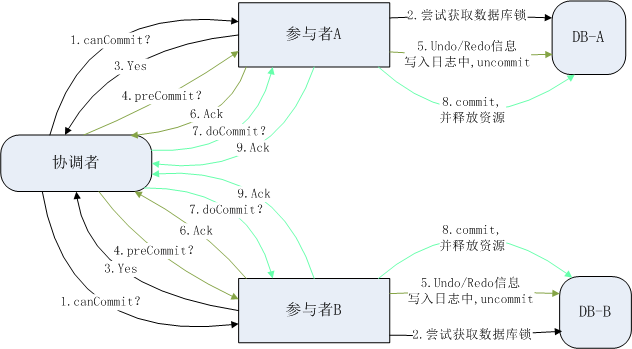

<!--v-->

## 3PC Phase3: DoCommit

Situation 2: Some replies are NO -> Rollback

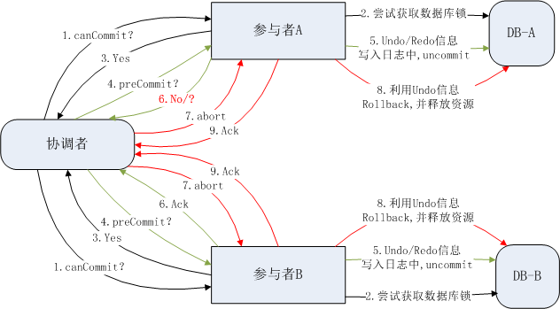

<!--v-->

## 3PC Pros and Cons

### Pros

1. Better solves single point of failure and blocking problems
2. Enhances system availability and robustness
3. Improves transaction execution efficiency

### Cons

1. Higher message overhead
2. Increased complexity
3. Blocking problem still exists

<!--s-->

# Part.2 Paxos

<!--v-->

## Introduction

**Paxos**：由 Lamport 宗师提出，是一种基于**消息传递**且具有**高度容错特性**的分布式**一致性算法**，旨在解决在一个可能发生故障的分布式系统中，如何快速正确地在集群内对**某个值**达成一致，并保证整个系统的一致性，是目前公认的解决分布式一致性问题**最有效**的算法之一。

> Google Chubby的作者Mike Burrows说过这个世界上**只有一种**一致性算法，那就是Paxos，其它的算法都是**残次品**。

<!--v-->

## Roles

- Proposer: propose a value(value can be anything like a command, a data, etc.)
- Acceptor: respond to proposals from proposers(for validating proposals and ensuring agreement)
- Learner: learn the agreed-upon value

> *Nodes can play **multiple** roles at a time.*

##### Other Conceptions

- 提案 Proposal: include the **value** we need
- 法定人数 Quorum(normally majority) 多数派思想

<!--v-->

## Phases: Prepare & Accept

- Proposer选择一个**提案编号** N，然后向**半数以上**的Acceptor发送编号为N的**Prepare请求**。

- 如果一个Acceptor收到一个编号为N的Prepare请求，且N**大于**该Acceptor已经**响应过的**所有**Prepare请求**的编号，那么它就会将它已经**接受过的编号最大的提案（如果有的话）**作为响应反馈给Proposer，同时该Acceptor承诺**不再接受**任何**编号小于N的提案**。

- 如果Proposer收到**半数以上**Acceptor对其发出的编号为N的Prepare请求的**响应**，那么它就会发送一个针对[N,V]提案的**Accept请求**给**半数以上**的Acceptor。

    注意：V就是收到的**响应**中**编号最大的提案的value**，如果响应中**不包含任何提案**，那么V就由Proposer**自己决定**。

- 如果Acceptor收到一个针对编号为N的提案的Accept请求，只要该Acceptor**没有**对编号**大于N**的**Prepare请求**做出过**响应**，它就**接受该提案**。

<!--v-->

## How Learner Works

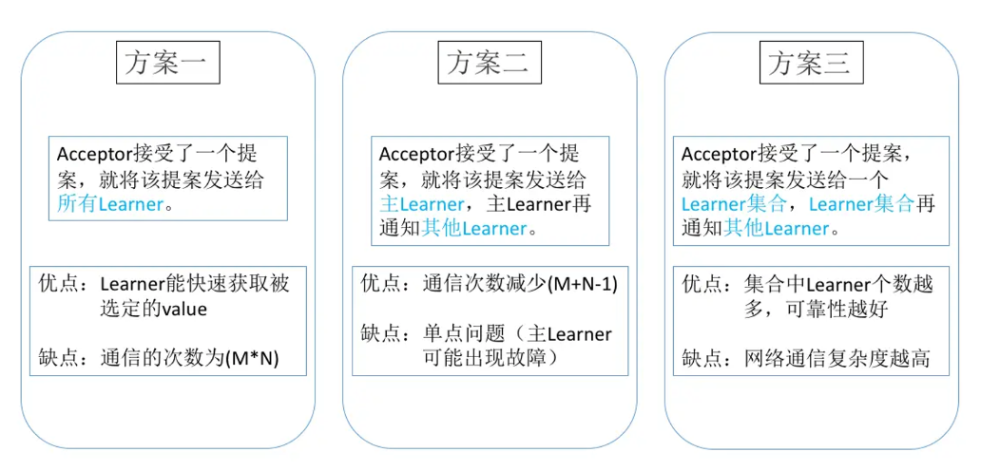

<!--v-->

## Safety: Live Lock Problem

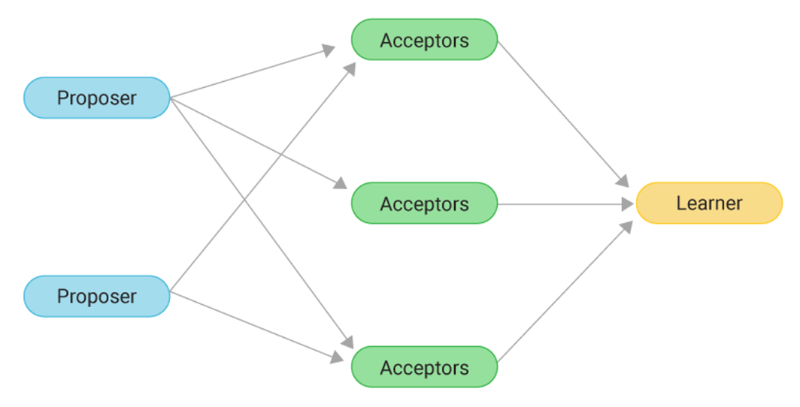

<!--v-->

## Improvement: Multi-Paxos

- Basic Paxos 算法只能对单个值达成共识，对于多个值的情形，Basic Paxos 算法就不管用了。因此，在实际应用中，我们可能需要多次执行 Basic Paxos 实例方式（也就是Multi Paxos 思想），来实现一系列值的共识，但这会出现很多问题：

  - 如果集群中多个提议者同时在准备阶段提交提案，可能会出现没有提议者接收到大多数准备响应，导致需要重新提交准备请求。例如，在一个 5 个节点的集群中，有 3 个节点同时作为提议者同时提交提案，那就会出现没有一个提议者获取大多数的准备响应，而需要重新提交
  - 为了达成一个值的共识，需要进行 2 轮 RPC 通讯，分别是准备阶段和接受阶段，性能低下

- Basic Paxos 算法只能对单个值达成共识，对于多个值的情形，Basic Paxos 算法就不管用了。因此，Basic Paxos 算法几乎只是用来理论研究，并不直接应用在实际工作中。

所以，后来就出现了Raft等其他基于 Multi Paxos 思想的共识算法。

<!--s-->

# Part.3 Raft

The title of Raft paper speaks to its mission:

“In Search of an Understandable Consensus Algorithm.”

<!--s-->

# Part.4 ZAB

Zookeeper Atomic Broadcast

原子广播协议

<!--v-->

## 崩溃恢复

**Leader选举阶段**：Zab 协议需要保证选举出来的 Leader 需要满足的条件

1. 新选举出来的Leader不能包含未提交的Proposal。即新Leader必须都是已经提交了Proposal的Follower服务器节点。
2. 新选举的Leader节点中含有最大的zxid。这样做的好处是可以避免Leader服务器检查Proposal的提交和丢弃工作。

**数据恢复阶段**

1. 完成Leader选举后，在正式开始工作之前（接收事务请求，然后提出新的Proposal），Leader服务器会首先确认事务日志中的所有的Proposal 是否已经被集群中过半的服务器Commit。
2. Leader服务器需要确保所有的Follower服务器能够接收到每一条事务的Proposal，并且能将所有已经提交的事务Proposal应用到内存数据中。等到Follower将所有尚未同步的事务Proposal都从Leader服务器上同步过，并且应用到内存数据中以后，Leader才会把该Follower加入到真正可用的Follower列表中。

<!--v-->

## 消息广播

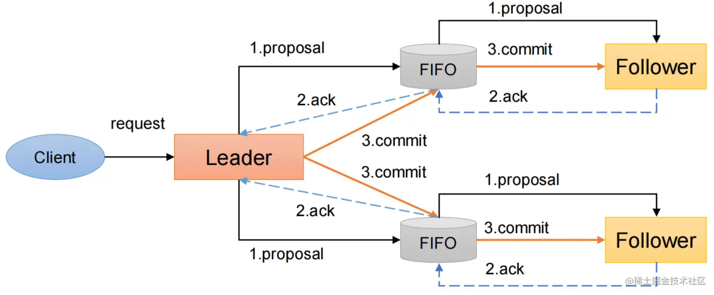

<!--v-->

## ZAB 和 Raft 对比

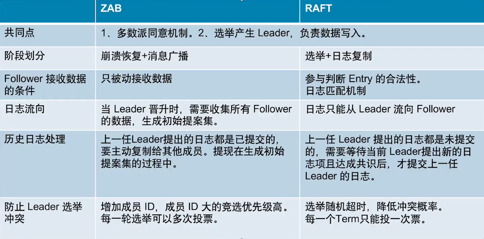

<!--s-->

# Part.5 Byzantine Problem

<!--v-->

## Description

> 拜占庭问题也是由 Paxos 算法的提出者 Lamport 提出的

- 拜占庭帝国派出多支军队去围攻一个强大的敌人，每支军队有一个将军，但由于将军在地理上是分隔开来的，他们之间**只能通过信使传递消息**。
- 敌方很强大，必须有**超过半数**的拜占庭军队一同参与进攻才可能击败敌人。
- 通讯员中存在**叛徒**，它们可以**篡改消息**，来欺骗某些将军采取进攻行动
- 在此期间，将军们彼此之间需要通过信使传递消息并协商一致后，在同一时间点发动进攻。

Paxos算法的前提假设是不存在拜占庭将军问题，即信道是安全可靠的，发出的信号不会被篡改，因为Paxos算法是基于消息传递的。

<!--s-->

# Thanks for Listening
